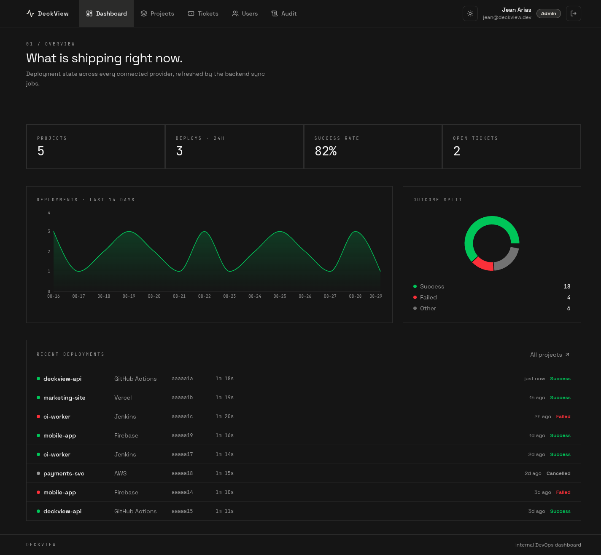
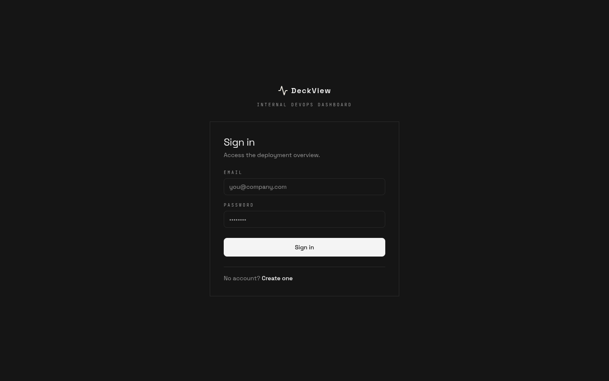
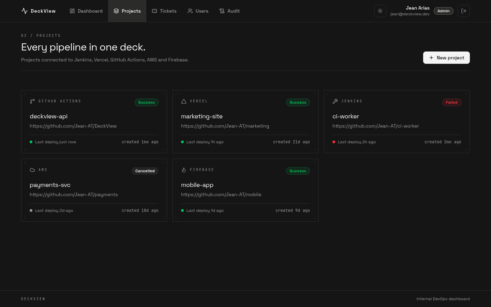
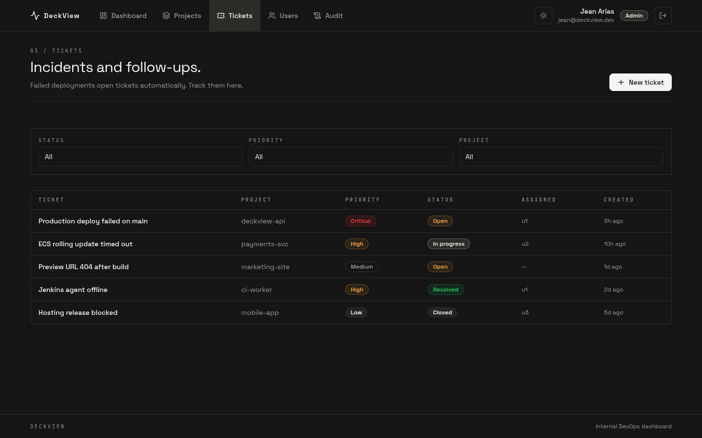
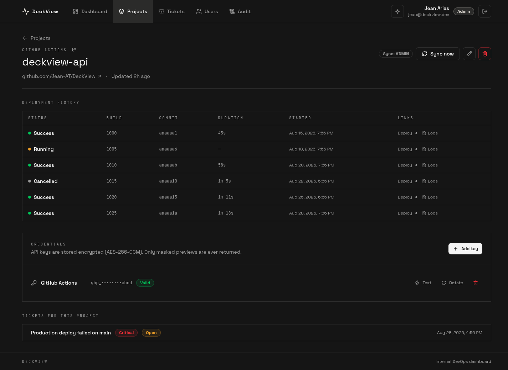

# DeckViewWebApp

<p align="center">
  
</p>

Frontend del dashboard DevOps interno **DeckView**. Centraliza proyectos, deploys y tickets de Jenkins, Vercel, GitHub Actions, AWS y Firebase.

El backend vive en [Jean-AT/DeckView](https://github.com/Jean-AT/DeckView) y tiene que estar corriendo para que la API responda.



## Capturas

| Login | Proyectos |
|---|---|
|  |  |

| Tickets | Detalle de proyecto |
|---|---|
|  |  |

## Funcionalidades

- **Autenticación** — login y registro. El primer usuario del backend queda como ADMIN.
- **Dashboard** — proyectos, deploys en las últimas 24 horas, tasa de éxito, tickets abiertos y gráficos analíticos.
- **Gestión de Proyectos** — CRUD, historial de deployments, sincronización (solo ADMIN) y credenciales enmascaradas.
- **Tickets** — seguimiento de incidencias, filtros avanzados y transiciones de estado.
- **Administración** — solo ADMIN: gestión de roles y auditoría completa de cambios.

Roles disponibles: `ADMIN`, `DEVELOPER`, `VIEWER`.

## Stack Tecnológico


## Requisitos Previos

- [Docker](https://docs.docker.com/get-docker/) y Docker Compose
- Backend DeckView en `http://localhost:3000` ([repositorio](https://github.com/Jean-AT/DeckView))

## Inicio Rápido con Docker

En cualquier máquina local:

```bash
git clone https://github.com/Jean-AT/DeckViewWebApp.git
cd DeckViewWebApp
docker compose up --build
```

Frontend disponible en: [http://localhost:8080](http://localhost:8080)

Nginx sirve la aplicación SPA y reenvía las rutas `/api` y `/health` al backend (`host.docker.internal:3000`). No es necesario configurar `VITE_API_URL` en Docker.

Si el backend está en otra URL o puerto:

```bash
BACKEND_URL=http://host.docker.internal:3000 PORT=8080 docker compose up --build
```

Opcionalmente, copia `.env.example` a `.env` para configuraciones persistentes:

```bash
cp .env.example .env
docker compose up --build
```

Para detener los contenedores:

```bash
docker compose down
```

## Desarrollo Local

El backend debe estar disponible en `localhost:3000`. Vite reenvía automáticamente `/api` hacia esta dirección.

```bash
cp .env.example .env
npm install
npm run dev          # http://localhost:5173
```

## Comandos Disponibles

| Comando | Descripción |
|---|---|
| `npm run dev` | Servidor de desarrollo Vite |
| `npm run build` | Compilación TypeScript + build de producción |
| `npm run preview` | Visualiza el build localmente |
| `npm run lint` | Validación con ESLint |
| `npm run typecheck` | Verificación de tipos sin emisión |
| `npm test` | Ejecución de pruebas unitarias |

## Variables de Configuración

| Variable | Contexto | Valor por Defecto | Descripción |
|---|---|---|---|
| `VITE_API_URL` | Vite (build/dev) | `/api` | URL base de la API en el navegador |
| `BACKEND_URL` | Docker/Nginx | `http://host.docker.internal:3000` | Destino del proxy `/api` (sin barra final) |
| `PORT` | Docker Compose | `8080` | Puerto del frontend en el host |

Las variables `VITE_*` se incrustan en el build. En Docker, no las modifiques: el navegador se comunica con `/api` y Nginx reenvía al backend.

## Estructura del Proyecto

```
src/
  components/ui/      Componentes base (badge, button, card, field, modal, spinner, stat, toast)
  components/layout/  AppShell (navegación, tema, información del usuario)
  features/           Módulos funcionales (auth, dashboard, projects, tickets, users, audit)
  queries/            Hooks personalizados de TanStack Query
  lib/                Utilidades (cliente API, autenticación, tokens, formatos, metadatos)
```
